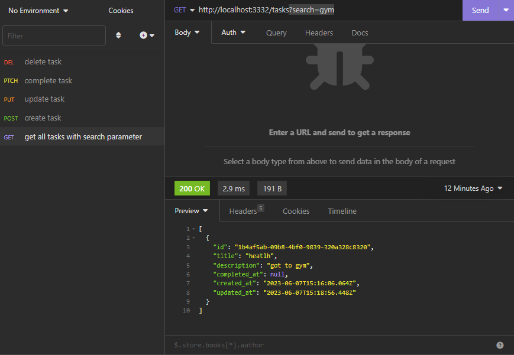

# API de tasks feita em Node.js

API de tasks feito em Node.js e recurso de upload de tasks via arquivo CSV.

## Stack utilizada

**Back-end:** Node, [csv-parse](https://csv.js.org/parse/)

## Rodando localmente

Clone o projeto

```bash
  git clone https://github.com/talinedacosta/node_tasks_api.git
```

Entre no diretório do projeto

```bash
  cd node_tasks_api
```

Instale as dependências

```bash
  npm install
```

Inicie o servidor

```bash
  npm run dev
```

### Estrutura de dados

- `id` - Identificador único de cada task
- `title` - Título da task
- `description` - Descrição da task
- `completed_at` - Data de quando a task foi concluída. Valor alternado `null`
- `created_at` - Data de quando a task foi criada
- `updated_at` - Data de quando a task foi atualizada

## Documentação da API

#### Retorna todos os itens

```http
  GET /tasks
```

| Parâmetro   | Tipo       | Descrição                           |
| :---------- | :--------- | :---------------------------------- |
| `search` | `string` | **Opcional**. Retorna busca filtrada por title e description |

#### Cria uma task

```http
  POST /tasks
```

| Body   | Tipo       | Descrição                                   |
| :---------- | :--------- | :------------------------------------------ |
| `title`      | `string` | **Obrigatório**. Título da task |
| `description`      | `string` | **Obrigatório**. Descrição da task |


#### Edita uma task
##### Obrigatório pelo menos um dos parâmetros (title ou description)

```http
  PUT /tasks/:id
```

| Body   | Tipo       | Descrição                                   |
| :---------- | :--------- | :------------------------------------------ |
| `title`      | `string` | **Obrigatório e Opcional**. Título da task |
| `description`      | `string` | **Obrigatório e Opcional**. Descrição da task |


#### Alterna o complete_at da task

```http
  PATCH /tasks/:id/complete
```

| Parâmetro   | Tipo       | Descrição                                   |
| :---------- | :--------- | :------------------------------------------ |
| `id`      | `string` | **Obrigatório**. O ID da task |

#### Deletar uma task

```http
  PATCH /tasks/:id
```

| Parâmetro   | Tipo       | Descrição                                   |
| :---------- | :--------- | :------------------------------------------ |
| `id`      | `string` | **Obrigatório**. O ID da task |

#### Upload de task via CSV

Com o servidor aberto na **porta 3332**, rode no terminal
```bash
node streams/upload-csv-stream.js
```
Você poderá ver as tasks adicionadas pelo arquivo **db.json** ou pela rota de `GET /tasks`.

## Exemplo de consumo de rota (via [Insomnia](https://insomnia.rest/))


## Referência

 - [Rockseat](https://www.rocketseat.com.br/)
